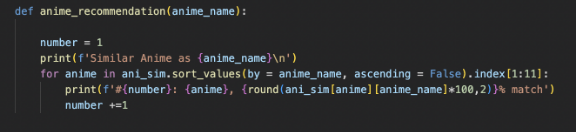
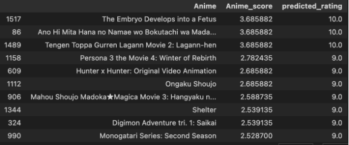
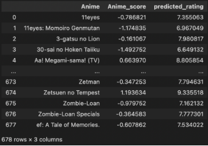

Anime Recommender System

Ashwinkumar Ajithkumar Pillai, Vatsal Thakkar

1  Introduction

The purpose of our recommender system is to recommend related animes based on the given anime. The input to our model is an anime and the output is the top 10 animes that are similar to it.

We are using collaborative filtering to achieve this objective. The relevance is computed in two ways here:

1. Similarity between anime based on the ratings they have received
1. Similarity between the users who have rated these animes. The first one is item-item CF and the second is user-user CF.
2  Dataset details

The dataset used for the model is Anime Recommendation Dataset - <https://www.kaggle.com/datasets/hernan4444/anime-recommendation-database-2020>

For each anime we have the following features:

- Genres that the anime fall into,
- English and Japanese name of the anime,
- Number of episodes it has,
- When it was premiered and aired,
- The producers, licensors, studios, and source,
- Duration, rating, popularity.
- Number of users who have the anime on Hold, are watching, completed, Dropped, or plan to watch,
- And finally all animes are rated from 1-10 like IMDB ratings and we have data on each anime that how many users have given a particular rating to it.
- For example 1000 have rated it 5 10k have rated it 8 and so on.

We also have data of each user mapped to each anime and what they have rated the anime: (user~~ id - anime~~ id):= rating

1. Dataset size

Number of anime in the dataset: 17558 Number of users in the dataset: 310059

2. Data Insights
1. User - Anime Rating snap

2. item Number of users associated with a rating R

From the above visualization, it can be observed that most users have given a rating between 7 and 9. Very few proportion of the users have given a rating less than 5

3. Histogram of users and the number of animes they have rated.

Here we can see that most users (Almost 90%) have rated 1-200 animes

6k users have only rated 1 anime

2k have rated 5 animes

Most users have rated in the range of 1-200 as stated above among the 17k users While there is one user who has rated 15k anime.

This data is shown in the below image

4. Animes are associated with more than one genre

3  Pre-processing
1. Remove all anime and users that have null values - animes with no rating or users who have not rated any anime will be removed. Our dataset didn’t have any anime or users with such conditions.

   

   

2. Filtering users with less than 400 reviews

This is necessary as the users who have extensively rated will have more similarities. We don’t want to take users who have made very few ratings as that doesn’t represent the popular rating on the anime. This will help in giving more generalized data and will focus on popularity among anime fans. The reason for selecting 400 was that we checked with other values but 400 seemed reasonable among them. Ideally, we should have gone with 200 but our processor doesn’t have the computing power needed for that.

This reduced the number of anime to 16844.

And the number of users to 35292.

4  Item-Item Similarity
1. Anime - User interaction matrix

We first create the anime user interaction matrix. It will have the following dimensions: 16844 x 35292 (anime x users)

2. Normalizing the matrix

Now we carry out the processing of the interaction matrix in 4 stages:

As we can see there are a lot of NaN values so we need to remove those and also normalize the matrix.

pivot~~ normalized = anime~~ pivot.apply(lambda x: (x-np.mean(x))/(np.max(x) - np.min(x)), axis=0) We subtract the average rating from each rating and divide it by the difference between the max and min ratings.

Replacing NaN values with 0:

pivot~~ normalized.fillna(0, inplace=True)

The anime that has no rating will be removed:

pivot~~ n1 = pivot~~ normalized.loc[:, (pivot~~ normalized != 0).any(axis=0)]

Generate CSR matrix: - since we need to efficiently process sparse matrix: piv~~ sparse1 = csr~~ matrix(pivot~~ n1.values)

3. Cosine Similarity

We use cosine similarity as the similarity function anime~~ similarity = cosine~~ similarity(piv~~ sparse1)

4. Item-Item Similarity Matrix

We use the cosine similarity between the animes to build the (anime x anime) similarity matrix 5. Item-Item Recommender System

Now that we have built the model, let’s try to run it for the anime - Naruto.

As we can see we have the top 10 recommendations for the keyword Naruto.

The first result is Naruto Shippuden itself.

Bleach is the second result and is relevant since Naruto and Bleach are among two of ”The Big Three” animes.

Dragon Ball and Death Note are also earlier animes with the protagonist character being very pow- erful. This is also true for Shingeki no Kyojin.

Apart from the story and genre, these animes are all popular too so they fall into the same category and these results are indeed relevant.

Now we build the second Collaborative filtering model in the next section:

5  User-User Similarity
1. Anime-User Interaction matrix and Normalization

We again use the anime-user interaction matrix we built in the first step of the item-item simi- larity method.

This time we only subtract the average rating from each rating for normalization and we take the transpose of the matrix since we need to build the user-user matrix:

2. Cosine Similarity

Same as item-item, for user-user similarity we use cosine similarity as the similarity function: user~~ similarity = cosine~~ similarity(piv~~ sparse2)

3. User-User Similarity Matrix

4. Finding anime based on similar users

We will find 10 users that have the most similar tastes for each of the users. For example, let’s check for one user- here we are taking a user with id 17 and we find the top 10 users that have similar tastes.

Then we will look at the animes that those 10 users have watched and rated. We remove the animes

that user~~ id 17 has watched from that anime list.

Now we have new animes for user 17 that the user has not watched. From these animes using user~~ id 17 and the 10 users, we will predict the ratings for each of the new animes.

Then we will suggest the top 10 animes from this list to the user

Users that are similar to user 17:

Extract the animes user~~ id 17 has watched:

Remove animes that none of the similar users have watched

Remove Animes that the selected user has watched:

Remove the watched anime from the anime list

Now that we have the list of new animes to suggest to user we will predict the rating (anime~~ score) for each anime and then select the top 10 rated animes from this new anime list

The results are shown in the below diagram:

we add the average rating to these new anime since we removed it earlier in the matrix

If we hadn’t removed the average rating earlier for normalization, then we should add the actual rating to the score and then predict the rating

We do this for all the users:

Let’s try for user 346: recommend~~ user(346):=

The above result is for user 346.

We can also check for user 20468

5. Splitting the dataset

We split the dataset into 70-30. 70% split goes to training and the remaining 30% to test data. Training set will have 24704 rows × 16838 columns (users x anime)

Testing set will have 10588 rows × 16838 columns (users x anime)

6. Accuracy of prediction

Now we want to check how accurate our prediction is: For this, we find ratings for animes based on similarity for the users that have already rated it.

Predictions for anime ratings:

Ground Truth: Actual rating of animes:

Model Prediction: Rating predicted by the model

Comparing the above two, we can see that the predictions are very close. Various Error Metrics:

We Find the mean squared error across all users:

Mean Squared Error:

This concludes the user-user collaborative filtering model with a mean squared error of 1.7069004155138134

6  Future Scope

Using click-through rate (CTR) we can get real-time data on how the users select anime and improve our recommendations.

7  Conclusion

Our Model successfully recommended animes based on anime similarity and user similarity based on ratings.

The item-item CF recommended anime based on the similarity between the anime. and user-user- suggested animes based on similar users’ tastes.

We also included the use case of recommending animes that the user has not watched yet instead of directly returning the top 10 results. And for testing accuracy, we used Mean-Squared-Error and got a satisfactory result of 1.7
19
